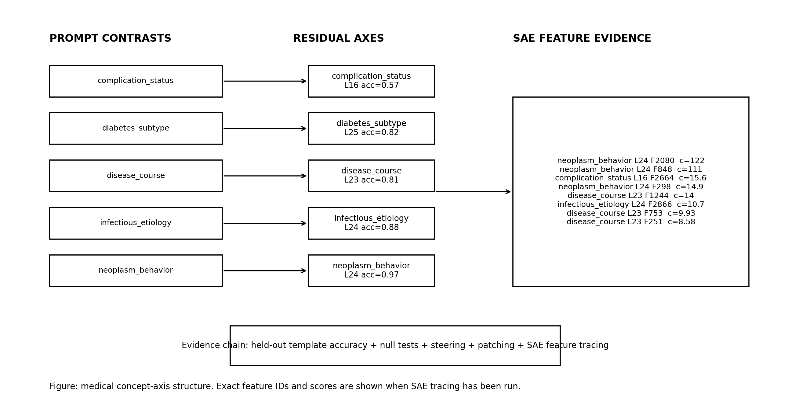
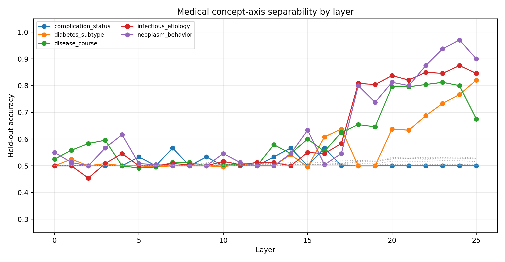
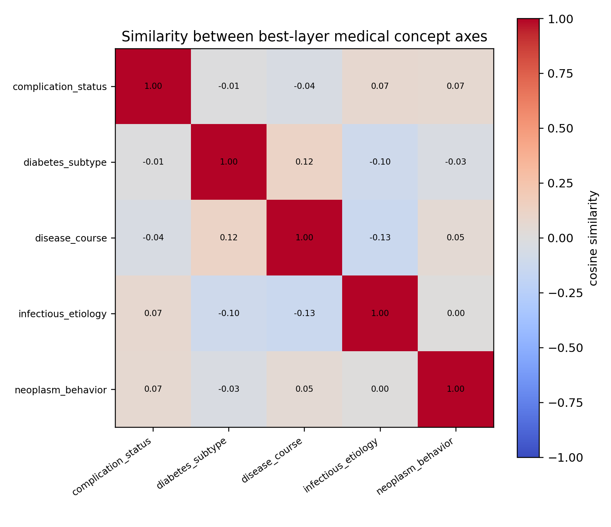
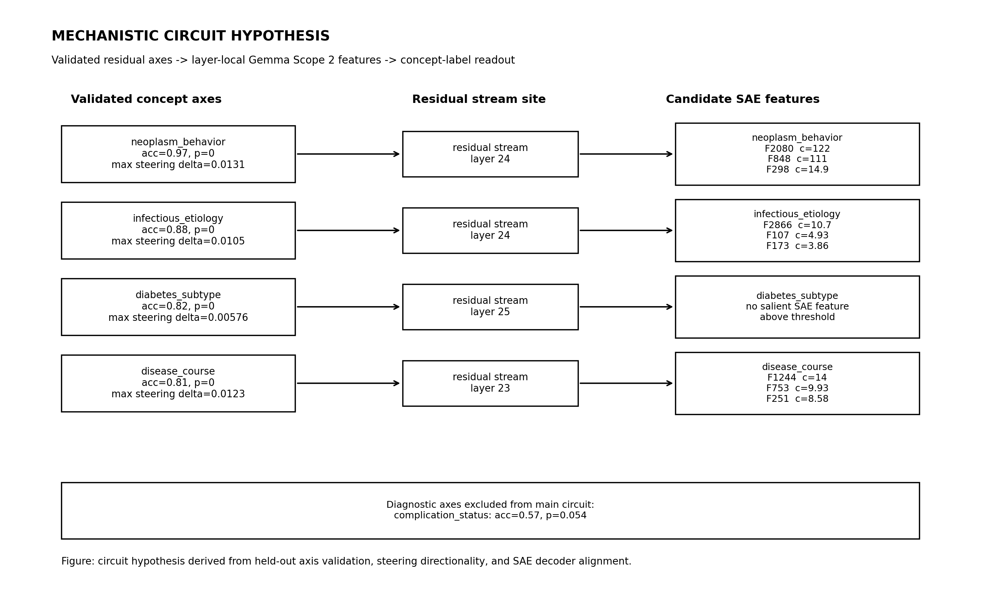
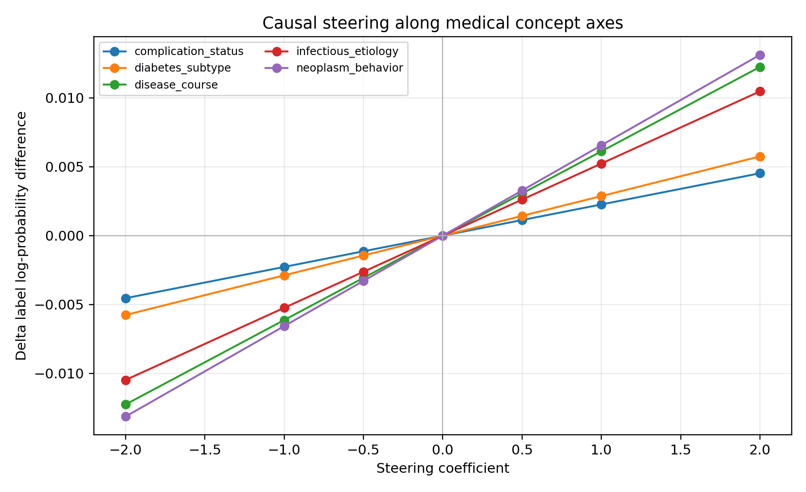
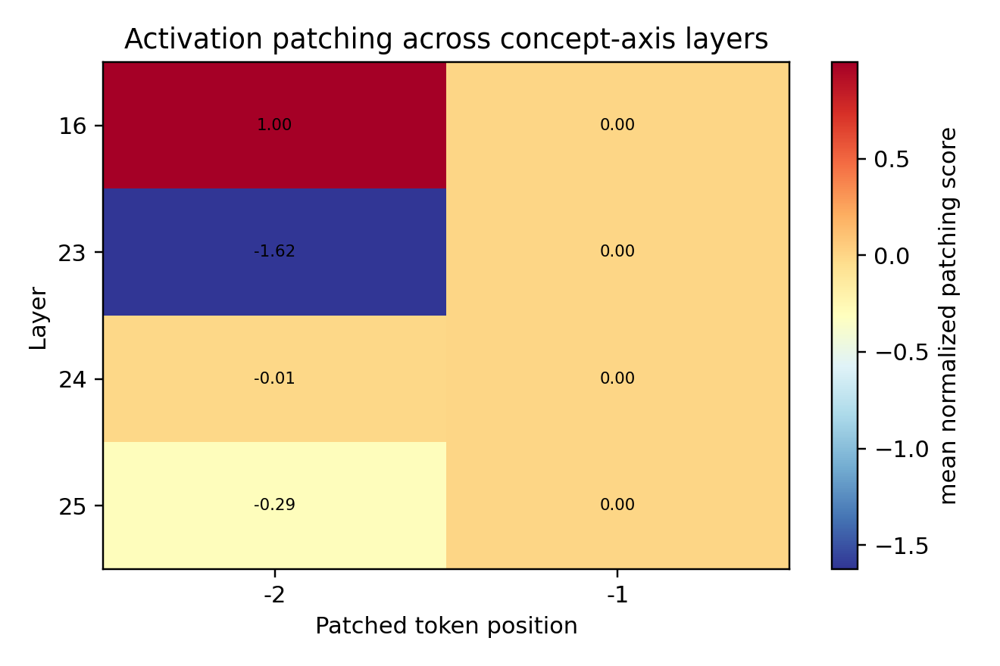
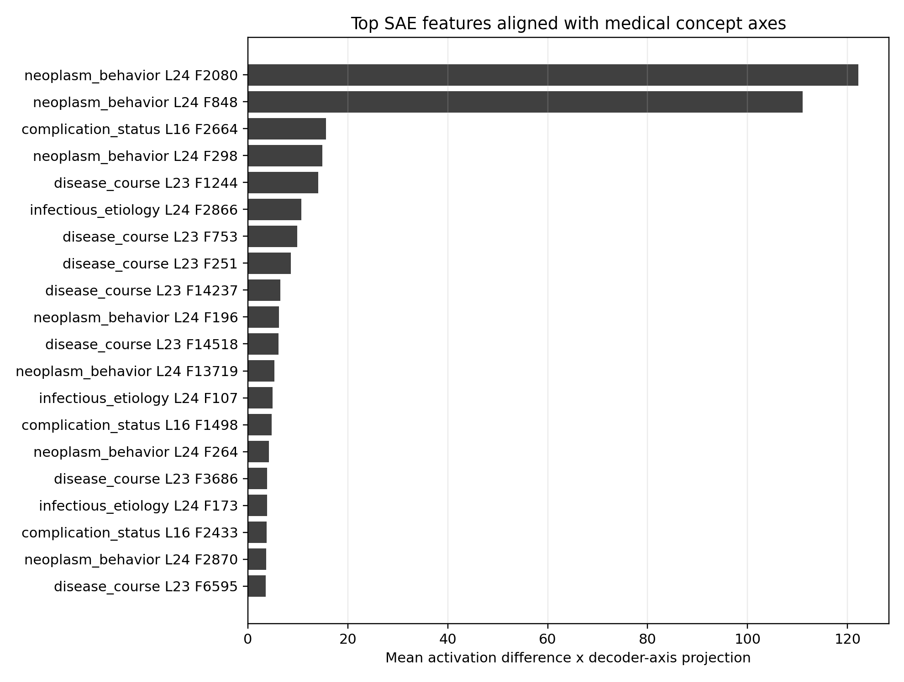

# Medical Concept Axis Experiment Report

## Research Question

This experiment tests whether medical concepts form measurable residual-stream directions in an instruction-tuned language model, and whether those directions have causal effects on concept readouts. The design follows the contrast-vector logic of the Assistant Axis paper, but evaluates medical ontology contrasts rather than persona contrasts.

## Local Hardware

- Target runtime: CPU-first local reproduction.
- Main model: `google/gemma-3-1b-it`.
- SAE source: Gemma Scope 2 residual-stream SAEs through SAELens.

## Data

- Prompt rows: 3300
- Prompt construction uses ICD/CCS diagnosis descriptions and held-out templates.
- Readout uses concept labels, not specific drug names.

## Axis Sweep

| axis_id | best_layer | test_accuracy | test_ci_low | test_ci_high | random_null_mean | permutation_p |
| --- | --- | --- | --- | --- | --- | --- |
| complication_status | 16 | 0.5666666666666667 | 0.36666666666666664 | 0.7333333333333333 | 0.5033666666666666 | 0.054 |
| diabetes_subtype | 25 | 0.8208333333333333 | 0.7708333333333334 | 0.8708333333333333 | 0.5161208333333333 | 0.0 |
| disease_course | 23 | 0.8125 | 0.7625 | 0.8583333333333333 | 0.5294333333333334 | 0.0 |
| infectious_etiology | 24 | 0.875 | 0.8333333333333334 | 0.9166666666666666 | 0.5326916666666666 | 0.0 |
| neoplasm_behavior | 24 | 0.9708333333333333 | 0.95 | 0.9916666666666667 | 0.5257875 | 0.0 |

## Mechanistic Circuit Summary

The circuit figure reports the axes that pass held-out and permutation-null checks, then links them to candidate Gemma Scope 2 residual-stream features. Axes that fail the validation criteria should be treated as diagnostics rather than primary evidence.

## Causal Steering

| axis_id | layer | alpha | mean_logprob_diff | delta_logprob_diff |
| --- | --- | --- | --- | --- |
| complication_status | 16 | -2.0 | -0.12743232218781486 | -0.004538048446799318 |
| complication_status | 16 | -1.0 | -0.12516135588521138 | -0.0022670821441958347 |
| complication_status | 16 | -0.5 | -0.12402612675214186 | -0.0011318530111263196 |
| complication_status | 16 | 0.0 | -0.12289427374101554 | 0.0 |
| complication_status | 16 | 0.5 | -0.12175938163030271 | 0.0011348921107128263 |
| complication_status | 16 | 1.0 | -0.12062637513736263 | 0.0022678986036529145 |
| complication_status | 16 | 2.0 | -0.1183628291861775 | 0.004531444554838042 |
| diabetes_subtype | 25 | -2.0 | -0.7298323554550734 | -0.005759409240151096 |
| diabetes_subtype | 25 | -1.0 | -0.7269519513514145 | -0.0028790051364921965 |
| diabetes_subtype | 25 | -0.5 | -0.7255116372549916 | -0.0014386910400692916 |

## Activation Patching

| axis_id | layer | position | normalized_score |
| --- | --- | --- | --- |
| complication_status | 16 | -1 | 0.0 |
| complication_status | 16 | -2 | 0.7776285448596728 |
| complication_status | 16 | -1 | 0.0 |
| complication_status | 16 | -2 | 0.8171012127502815 |
| complication_status | 16 | -1 | 0.0 |
| complication_status | 16 | -2 | 3.554699643080306 |
| complication_status | 16 | -1 | -0.0 |
| complication_status | 16 | -2 | -0.163714015286431 |
| complication_status | 16 | -1 | -0.0 |
| complication_status | 16 | -2 | 0.008553388552670748 |

## SAE Feature Tracing

| axis_id | layer | feature_id | axis_contribution | activation_diff | decoder_axis_dot |
| --- | --- | --- | --- | --- | --- |
| neoplasm_behavior | 24 | 2080 | 122.172607421875 | -382.1539306640625 | -0.31969475746154785 |
| neoplasm_behavior | 24 | 848 | 111.05461120605469 | 430.40557861328125 | 0.2580231726169586 |
| complication_status | 16 | 2664 | 15.614031791687012 | -99.23636627197266 | -0.1573418378829956 |
| neoplasm_behavior | 24 | 298 | 14.903264999389648 | 126.01081848144531 | 0.11826972663402557 |
| disease_course | 23 | 1244 | 14.042826652526855 | 102.410400390625 | 0.13712304830551147 |
| infectious_etiology | 24 | 2866 | 10.674056053161621 | 83.42012786865234 | 0.12795540690422058 |
| disease_course | 23 | 753 | 9.92818546295166 | 135.8896026611328 | 0.07306066900491714 |
| disease_course | 23 | 251 | 8.578081130981445 | 221.5247802734375 | 0.038722895085811615 |
| disease_course | 23 | 14237 | 6.483177661895752 | 73.93461608886719 | 0.08768798410892487 |
| neoplasm_behavior | 24 | 196 | 6.2132248878479 | -139.4635467529297 | -0.04455088824033737 |

## Interpretation

A concept axis should be treated as evidence for a structured representation only when the layer sweep, held-out label scoring, steering, patching, and SAE feature tracing agree. SAE features are candidate mechanistic units; they are not sufficient by themselves to claim a complete circuit.

## Limitations

- The primary local run is constrained to small open Gemma models by CPU-only hardware.
- Synthetic prompts test controlled concept representations, not clinical decision quality.
- Linear axes are a useful probe, but medical concepts may also be represented nonlinearly or distributed across many layers.
