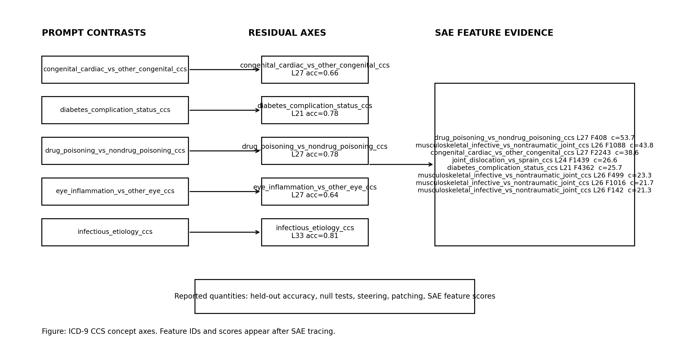
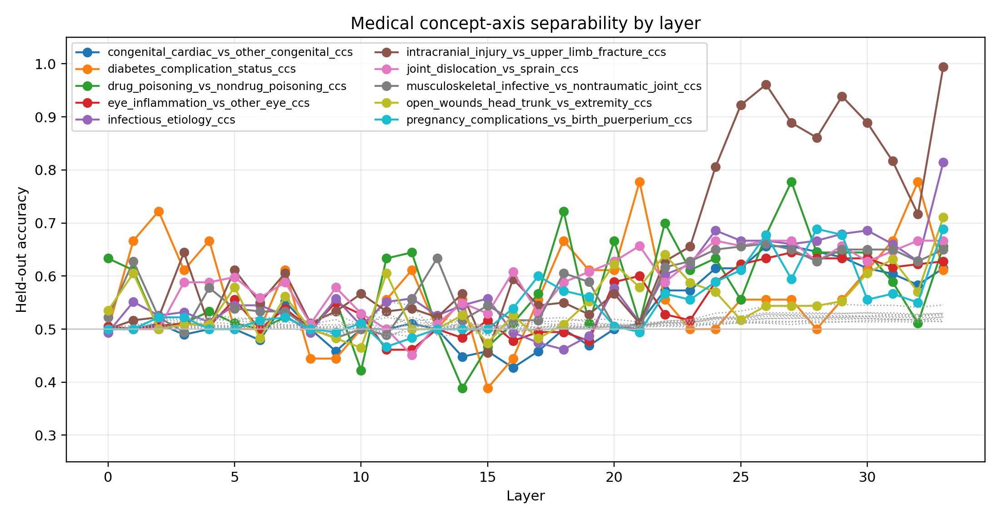
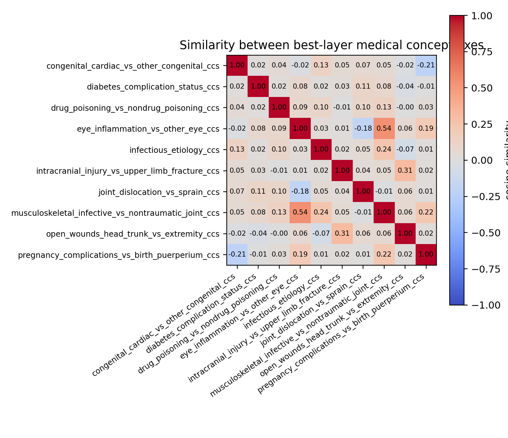
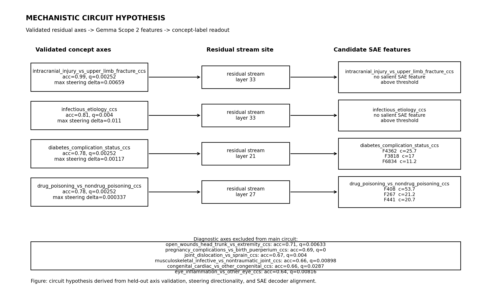
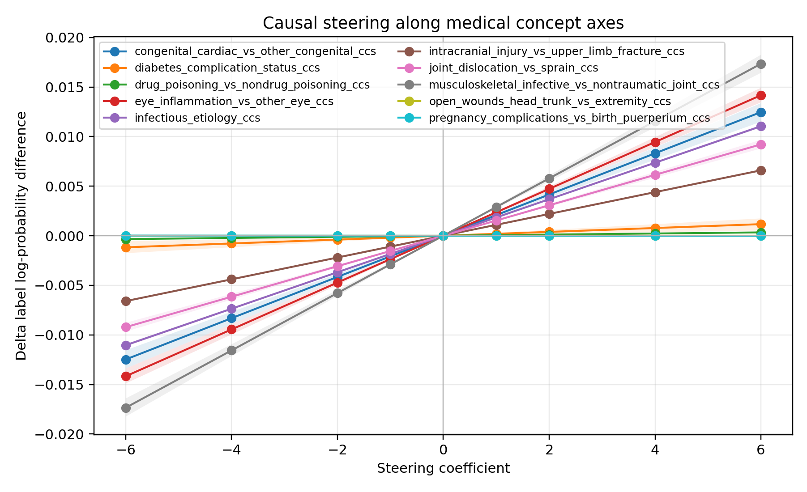
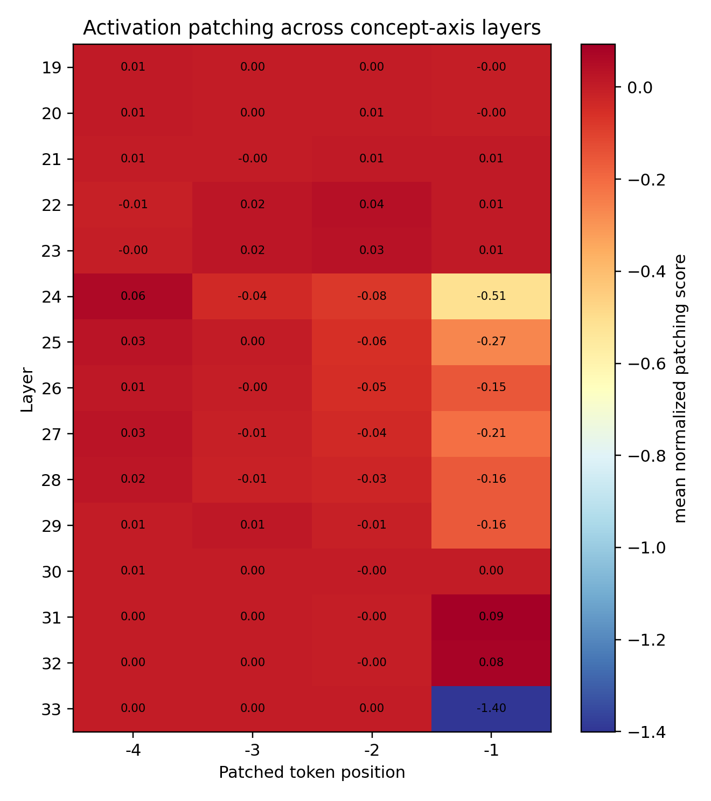
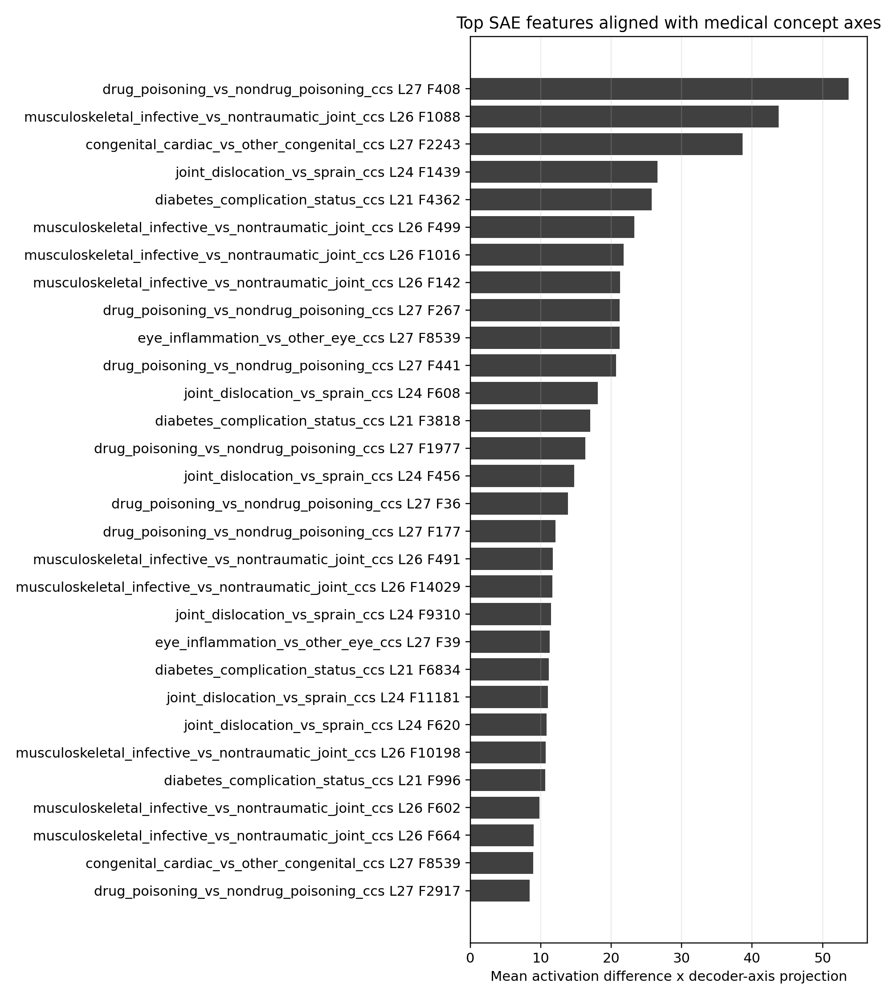

# Medical Concept Axis Experiment Report

## Research Question

This experiment tests whether ICD-9-CM CCS diagnosis concepts form measurable residual-stream directions in an instruction-tuned language model, and whether those directions have causal effects on concept readouts. The design follows the contrast-vector logic of the Assistant Axis paper, but evaluates medical ontology contrasts rather than persona contrasts.

## Model and Data

- Model: `google/gemma-3-4b-it`.
- SAE source: Gemma Scope 2 residual-stream SAEs through SAELens.
- Prompt rows: 17360
- Primary data source: AHRQ 2015 single-level CCS for ICD-9-CM diagnoses, joined to ICD-9 descriptions.
- Prompt construction uses held-out diagnosis pairs and held-out templates.
- Readout uses concept labels, not specific drug names.
- Lexical baselines are reported separately because several ontology contrasts are keyword-visible.

## Lexical Baseline

| axis_id | split | rows | answered | coverage | accuracy | accuracy_with_abstain_wrong |
| --- | --- | --- | --- | --- | --- | --- |
| congenital_cardiac_vs_other_congenital_ccs | test | 96 | 96 | 1.0 | 1.0 | 1.0 |
| diabetes_complication_status_ccs | test | 18 | 18 | 1.0 | 1.0 | 1.0 |
| drug_poisoning_vs_nondrug_poisoning_ccs | test | 90 | 90 | 1.0 | 1.0 | 1.0 |
| eye_inflammation_vs_other_eye_ccs | test | 180 | 180 | 1.0 | 1.0 | 1.0 |
| infectious_etiology_ccs | test | 156 | 156 | 1.0 | 1.0 | 1.0 |
| intracranial_injury_vs_upper_limb_fracture_ccs | test | 180 | 180 | 1.0 | 1.0 | 1.0 |
| joint_dislocation_vs_sprain_ccs | test | 102 | 102 | 1.0 | 1.0 | 1.0 |
| musculoskeletal_infective_vs_nontraumatic_joint_ccs | test | 180 | 180 | 1.0 | 1.0 | 1.0 |

## Axis Sweep

| axis_id | best_layer | test_accuracy | test_ci_low | test_ci_high | random_null_mean | permutation_p | permutation_q_bh |
| --- | --- | --- | --- | --- | --- | --- | --- |
| congenital_cardiac_vs_other_congenital_ccs | 27 | 0.65625 | 0.5625 | 0.75 | 0.5304875 | 0.0086 | 0.028666666666666667 |
| diabetes_complication_status_ccs | 21 | 0.7777777777777778 | 0.5555555555555556 | 0.9444444444444444 | 0.5093333333333334 | 0.0002 | 0.002518518518518519 |
| drug_poisoning_vs_nondrug_poisoning_ccs | 27 | 0.7777777777777778 | 0.6888888888888889 | 0.8555555555555555 | 0.5143088888888888 | 0.0002 | 0.002518518518518519 |
| eye_inflammation_vs_other_eye_ccs | 27 | 0.6444444444444445 | 0.5722222222222222 | 0.7111111111111111 | 0.5212533333333332 | 0.0012 | 0.008159999999999999 |
| infectious_etiology_ccs | 33 | 0.8141025641025641 | 0.75 | 0.8717948717948718 | 0.5300128205128205 | 0.0004 | 0.004 |
| intracranial_injury_vs_upper_limb_fracture_ccs | 33 | 0.9944444444444445 | 0.9833333333333333 | 1.0 | 0.5456166666666667 | 0.0002 | 0.002518518518518519 |
| joint_dislocation_vs_sprain_ccs | 24 | 0.6666666666666666 | 0.5686274509803921 | 0.7549019607843137 | 0.5230039215686274 | 0.0004 | 0.004 |
| musculoskeletal_infective_vs_nontraumatic_joint_ccs | 26 | 0.6611111111111111 | 0.5888888888888889 | 0.7277777777777777 | 0.5238666666666666 | 0.0014 | 0.008981132075471698 |

## Mechanistic Circuit Summary

The circuit figure reports axes that pass held-out and multiple-comparison-adjusted permutation-null checks, then links them to candidate Gemma Scope 2 residual-stream features. Non-primary or failed axes are diagnostics.

## Causal Steering

| axis_id | layer | alpha | mean_logprob_diff | delta_logprob_diff | delta_ci_low | delta_ci_high |
| --- | --- | --- | --- | --- | --- | --- |
| congenital_cardiac_vs_other_congenital_ccs | 27 | -6.0 | -12.807845585484756 | -0.012478360799529279 | -0.013384943466371625 | -0.011547583329956979 |
| congenital_cardiac_vs_other_congenital_ccs | 27 | -4.0 | -12.803683602105593 | -0.00831637742036643 | -0.008922600896282044 | -0.007671117940723586 |
| congenital_cardiac_vs_other_congenital_ccs | 27 | -2.0 | -12.799523819082728 | -0.004156594397500157 | -0.004468469891192702 | -0.0038430933869676664 |
| congenital_cardiac_vs_other_congenital_ccs | 27 | -1.0 | -12.797444766726889 | -0.002077542041661218 | -0.0022297523049928714 | -0.001915835101923828 |
| congenital_cardiac_vs_other_congenital_ccs | 27 | 0.0 | -12.795367224685227 | 0.0 | 0.0 | 0.0 |
| congenital_cardiac_vs_other_congenital_ccs | 27 | 1.0 | -12.793287150008837 | 0.0020800746763901166 | 0.0019179786012197533 | 0.0022321723496133926 |
| congenital_cardiac_vs_other_congenital_ccs | 27 | 2.0 | -12.791210129100364 | 0.004157095584863176 | 0.0038401946614612823 | 0.004455060683540069 |
| congenital_cardiac_vs_other_congenital_ccs | 27 | 4.0 | -12.787056320298385 | 0.008310904386841381 | 0.007664145620704706 | 0.008906595826313908 |
| congenital_cardiac_vs_other_congenital_ccs | 27 | 6.0 | -12.782902223533407 | 0.012465001151819402 | 0.011484577268856811 | 0.013365558562024185 |
| diabetes_complication_status_ccs | 21 | -6.0 | 6.390605448020829 | -0.001168821007013321 | -0.001757511900117 | -0.0005620378897421891 |

| axis_id | layer | mean_prompt_slope | slope_ci_low | slope_ci_high | positive_slope_fraction | prompts |
| --- | --- | --- | --- | --- | --- | --- |
| congenital_cardiac_vs_other_congenital_ccs | 27 | 0.0020785464528043983 | 0.0019240541855157192 | 0.002223427985299226 | 1.0 | 96 |
| diabetes_complication_status_ccs | 21 | 0.00019473414759189762 | 9.250637764732042e-05 | 0.0002896159019531794 | 0.7777777777777778 | 18 |
| drug_poisoning_vs_nondrug_poisoning_ccs | 27 | 5.61211722245763e-05 | 4.604718844392422e-05 | 6.648611832227574e-05 | 0.8555555555555555 | 90 |
| eye_inflammation_vs_other_eye_ccs | 27 | 0.002361868148021487 | 0.0022325977196982296 | 0.002481440661307588 | 1.0 | 120 |
| infectious_etiology_ccs | 33 | 0.0018403050800164544 | 0.001816859979792471 | 0.0018624820124510434 | 1.0 | 120 |
| intracranial_injury_vs_upper_limb_fracture_ccs | 33 | 0.0010990230377480301 | 0.0010864902689116216 | 0.0011118675437783113 | 1.0 | 120 |
| joint_dislocation_vs_sprain_ccs | 24 | 0.0015362694495111126 | 0.0014644827525923268 | 0.0016116855179880002 | 1.0 | 102 |
| musculoskeletal_infective_vs_nontraumatic_joint_ccs | 26 | 0.002890898948991453 | 0.0027330197715403496 | 0.0030341003941160055 | 1.0 | 120 |

## Activation Patching

| axis_id | layer | position | count | mean_normalized_score | ci_low | ci_high |
| --- | --- | --- | --- | --- | --- | --- |
| congenital_cardiac_vs_other_congenital_ccs | 25 | -4 | 16 | 0.0064660956269387195 | -0.0006348927563106933 | 0.01566187396035643 |
| congenital_cardiac_vs_other_congenital_ccs | 25 | -3 | 16 | 0.013161838083589823 | -0.008799078429949238 | 0.04062597994251604 |
| congenital_cardiac_vs_other_congenital_ccs | 25 | -2 | 16 | 0.0046585133750662155 | -0.010670472659078278 | 0.02130497502295261 |
| congenital_cardiac_vs_other_congenital_ccs | 25 | -1 | 16 | 0.012167078371804786 | -0.35172546215440903 | 0.34424298524545677 |
| congenital_cardiac_vs_other_congenital_ccs | 26 | -4 | 16 | 0.0009431695952130371 | -0.005051913568897689 | 0.007309025304260699 |
| congenital_cardiac_vs_other_congenital_ccs | 26 | -3 | 16 | 0.013464162739683623 | -0.010307459890536901 | 0.04178882532795623 |
| congenital_cardiac_vs_other_congenital_ccs | 26 | -2 | 16 | 0.004209638291076193 | -0.011099827966657611 | 0.020521157752680416 |
| congenital_cardiac_vs_other_congenital_ccs | 26 | -1 | 16 | 0.03958916840948801 | -0.35643188458871083 | 0.4373189018234675 |
| congenital_cardiac_vs_other_congenital_ccs | 27 | -4 | 16 | -0.0007190633342449007 | -0.005417167234687095 | 0.00340448765981811 |
| congenital_cardiac_vs_other_congenital_ccs | 27 | -3 | 16 | 0.008207122903976329 | -0.018934139848299395 | 0.04112586297511048 |
| congenital_cardiac_vs_other_congenital_ccs | 27 | -2 | 16 | 0.013271970467055147 | -0.0006273610165094997 | 0.029598185308192616 |
| congenital_cardiac_vs_other_congenital_ccs | 27 | -1 | 16 | 0.021007428042042187 | -0.3784495113866483 | 0.42247672640514045 |

## SAE Feature Tracing

| axis_id | layer | feature_id | axis_contribution | activation_diff | decoder_axis_dot |
| --- | --- | --- | --- | --- | --- |
| drug_poisoning_vs_nondrug_poisoning_ccs | 27 | 408 | 53.662879943847656 | -205.58578491210938 | -0.26102426648139954 |
| musculoskeletal_infective_vs_nontraumatic_joint_ccs | 26 | 1088 | 43.78092956542969 | 280.7492980957031 | 0.1559431552886963 |
| congenital_cardiac_vs_other_congenital_ccs | 27 | 2243 | 38.63969039916992 | 60.025543212890625 | 0.643720805644989 |
| joint_dislocation_vs_sprain_ccs | 24 | 1439 | 26.552690505981445 | -211.2185821533203 | -0.12571190297603607 |
| diabetes_complication_status_ccs | 21 | 4362 | 25.737979888916016 | -213.48182678222656 | -0.12056285887956619 |
| musculoskeletal_infective_vs_nontraumatic_joint_ccs | 26 | 499 | 23.272174835205078 | -226.78160095214844 | -0.10261932760477066 |
| musculoskeletal_infective_vs_nontraumatic_joint_ccs | 26 | 1016 | 21.743452072143555 | -323.6306457519531 | -0.06718601286411285 |
| musculoskeletal_infective_vs_nontraumatic_joint_ccs | 26 | 142 | 21.280038833618164 | 174.77874755859375 | 0.12175415456295013 |
| drug_poisoning_vs_nondrug_poisoning_ccs | 27 | 267 | 21.20883560180664 | -82.32112884521484 | -0.2576353847980499 |
| eye_inflammation_vs_other_eye_ccs | 27 | 8539 | 21.183528900146484 | 322.76043701171875 | 0.06563235819339752 |

## Interpretation

A concept axis should be treated as evidence for a structured representation only when it is a primary ICD-9 CCS contrast and the layer sweep, held-out label scoring, steering, patching, and SAE feature tracing agree. SAE features are candidate mechanistic units; they are not sufficient by themselves to claim a complete circuit.

## Reproducibility Checklist

- Fixed model: `google/gemma-3-4b-it`.
- Primary code system: ICD-9-CM CCS Appendix A; ICD-10 rows are excluded from primary claims.
- Held-out diagnosis pairs and held-out templates are both used for primary evaluation.
- Bootstrap intervals, random-direction nulls, and label-permutation nulls are reported for the axis sweep.
- Steering and patching are evaluated on held-out prompts.
- SAE feature tracing is used as candidate mechanistic decomposition, not as standalone evidence.
